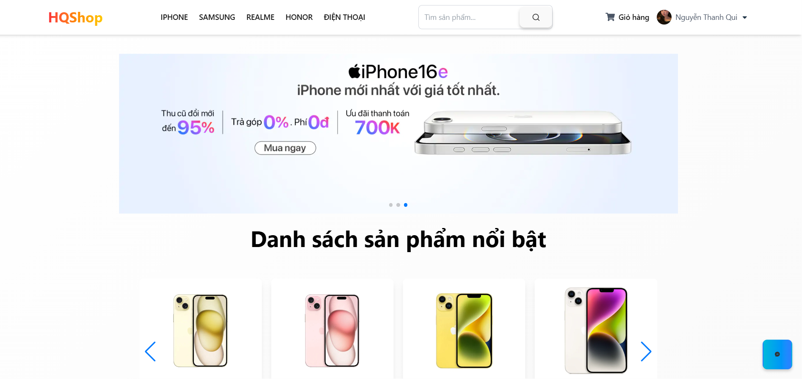

# 👋 Xin chào, mình là Nguyễn Thanh Qui
- 💻 Sinh viên ngành Công nghệ Thông tin
- 🔧 Kỹ năng: Java, Python, HTML/CSS, React, SQL,...
- 📦 Công cụ: VSCode, Git, Postman, Figma,...
- 📚 Dự án: Website bán hàng
## Tên dự án: Quản lý cửa hàng điện thoại
- 🔧 Công nghệ: ReactJS, Node.js, MongoDB
- ✨ Tính năng: Đăng nhập, quản lý sản phẩm, đơn hàng,...
- 📸 Hình ảnh: 

- 📄 Hướng dẫn chạy: npm install && npm start
